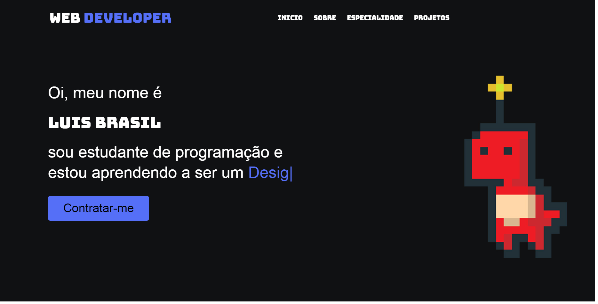

<h3 align="center">Meu primeiro projeto de site</h2>

<h3 align="center">Clique<a href="https://capitaozila.github.io/Port/"> aqui</a> para abrir</h2>

É um portofolio feito do que eu aprendi com o Curso de HTML5 e CSS3 do Guanabara.
Caso queiram ver a playlist completa basta clicar<a href="https://youtu.be/Ejkb_YpuHWs"> aqui.</a> É um curso completo que vai desde o básico de como funciona a internet e como ela surgiu, até a programação web Front-End

<h3 align="center">Ditática exemplar</h2>
E de graça com matériais extras para aqueles que não gostam de ver playlist longas de videos.

<h3 align="center">Links e documentações</h3>

Importantíssimas para você aprender HTML5 e CSS3

<ol>
    <li><a href="https://www.w3schools.com/html/">W3Schools</a>
O site perfeito para buscar exercícios, exemplos e muita documentação.
</li>
    <li><a href="https://www.youtube.com/watch?v=Kg4bqzAqRBM">Curso em Vídeo</a>
Um dos melhores canais de programação do Brasil, com uma didática exemplar.
</li>
    <li><a href="https://developer.mozilla.org/pt-BR/docs/Learn/Getting_started_with_the_web">Introdução à Web (Mozila)</a>
É uma série concisa que apresenta os aspectos práticos do desenvolvimento web. Você configurará as ferramentas necessárias para construir uma página web simples e publicará seu próprio código.
</li>
    <li><a href="https://pt.khanacademy.org/computing/computer-programming/html-css">Introdução a HTML/CSS (Khan Academy)</a>
Uma formação completa em Desenvolvimento Web gratuita e com sistema gamificado onde você pode conseguir conquista por assistir e completar atividades.
</li>
</ol>